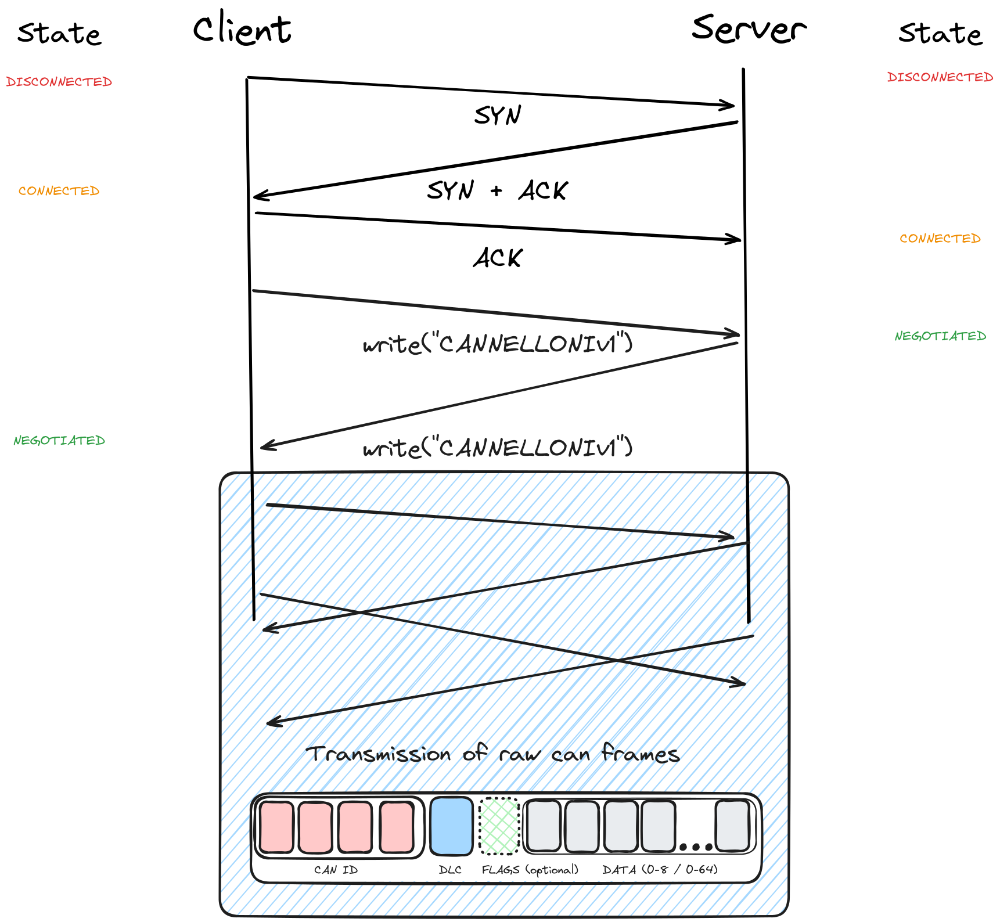

# cannelloni TCP Protocol version 1

After connecting, each peer is expected to send the string `"CANNELLONIv1"`, without a terminator (`\0`).

Then frames are send in both directions in binary encoding. The structure is similar to the UDP / SCTP
protocol:

| Bytes |  Name   |   Description       |
|-------|---------|---------------------|
|   4   |  can_id |  see `<linux/can.h>`|
|   1   |  len    |  size of payload/dlc|
|   1   |  flags^ |  CAN FD flags       |
|0-8/64 |  data   |  Data section       |

^ = CAN FD only

Everything is Big-Endian/Network Byte Order.

There is no delimiter, after the last byte of the first frame, the next frame's can_id is expected.
Be aware that a frame might be complete after just the `len` information. You can check `decoder.cpp`
for a state-machine based decoder for streams and `parser.cpp` for a general code to encode
frames.

## CAN FD

CAN FD frames are marked with the MSB of `len` being
set, so `len | (0x80)`. If this bit is set, the `flags`
attribute is inserted between `len` and `data`.
For CAN 2.0 frames this attribute is missing.
`data` can be 0-8 Bytes long for CAN 2.0 and 0-64 Bytes
for CAN FD frames.
